# Product and Architecture

Product definition, platform promise, and the final end-to-end architecture.

> Converted from `Datok — Final End-to-End Architecture, Company Onboarding, Connector Implementation, and Dashboard Data Workflow (1).pdf`. Technical wording is preserved; PDF-only visual layouts are represented as Markdown-native diagrams or text blocks.

## 1. Product Definition

Datok is a multi-tenant Executive Marketing Intelligence Platform. It connects advertising, analytics, ecommerce, and affiliate platforms; converts their fragmented data into a standardized marketing model; calculates trusted business KPIs; displays those KPIs across executive dashboard modules; and uses AI to explain performance changes and recommend actions. The core product promise is: Datok gives executives one trusted place to understand what happened, why it happened, and what the marketing organization should do next. The first production use case is the Red Wing Executive Marketing Command Center, but the architecture is designed so future companies can onboard without product-specific code changes.

## 2. Final End-to-End Architecture

```mermaid
flowchart TD
    A["CUSTOMER ORGANIZATIONS<br/>Red Wing · Future Enterprises · Agencies · Multi-Brand Companies"]
    B["COMPANY AND ACCESS LAYER<br/>Organization · Users · Roles · Brands · Business Units · Markets<br/>Permissions · Reporting Timezone · Currency · Attribution Rules"]
    C["DATA SOURCE LAYER<br/>Google Ads · GA4 · Microsoft Ads · AvantLink · Rakuten<br/>Future: Meta Ads · Amazon Ads · Shopify · CRM · Internal Systems"]
    D["CONNECTOR LAYER<br/>OAuth · Token Refresh · Account Discovery · API Calls · Webhooks<br/>Rate Limits · Pagination · Retry · Health Checks · Sync Scheduling"]
    E["INGESTION LAYER<br/>Historical Backfill · Incremental Sync · Checkpoints · Job Queue<br/>Raw Payload Storage · Sync Logs · Failure Tracking"]
    F["NORMALIZATION AND MAPPING<br/>Shared Dates · Currency · Channel · Campaign · Business Unit<br/>Brand Mapping · Account Mapping · Source-of-Truth Rules"]
    G["CANONICAL MARKETING DATABASE<br/>Organizations · Connections · Accounts · Campaigns · Daily Facts<br/>Revenue · Spend · Orders · Sessions · Clicks · Impressions"]
    H["DATA QUALITY AND RECONCILIATION<br/>Freshness · Missing Data · Duplicate Detection · Source Totals<br/>Currency Validation · Mapping Errors · Account Reconciliation"]
    I["CENTRAL KPI ENGINE<br/>Sales · Cost · ROAS · Orders · CPA · CTR · CVR · CPC · AOV<br/>Period Change · YoY · Contribution · Budget Pacing · Profit"]
    J["DASHBOARD AND REPORTING<br/>Dashboard · Performance · Channels · Campaigns · Business Units · Reports"]
    K["ALERT AND MONITORING ENGINE<br/>ROAS Decline · CPA Increase · Spend Anomaly · Budget Pacing<br/>Data Sync Failure · Revenue Drop"]
    L["AI INTELLIGENCE LAYER<br/>Executive Brief · Root-Cause Analysis · Risks · Opportunities<br/>Forecasts · Recommendations · Ask the Data · Evidence Validation"]
    M["FUTURE OPERATING SYSTEM<br/>Campaign Planning · Creative Assets · Approvals · Change Tracking<br/>Budget Recommendations · Controlled Marketing Actions"]

    A --> B --> C --> D --> E --> F --> G --> H --> I
    I --> J
    I --> K
    J --> L
    K --> L
    L --> M
```

